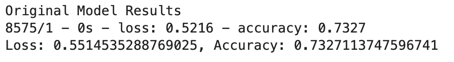
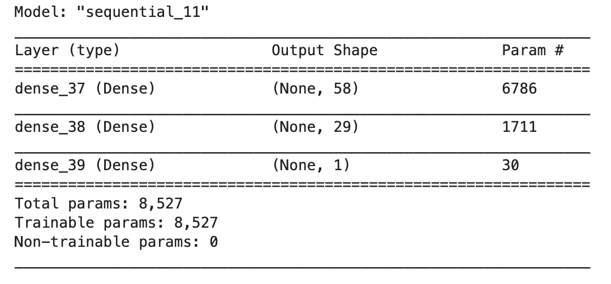

# Risk Management
## Start Ups & Imbalanced Soup

This notebook helps create models that can help determine if a startup will be successul or not. We are provided a CSV file with information about thousands of companies which should ultimately help to determine if they will be successful. We will create a binary classification model using a deep neural network. To do this we will preprocess the data for a neural network model, use the model-fit-predict pattern to compile and evaluate a binary classification model, and optimize the model.



_Model Accuracy_

---

## Technologies

This project uses a Jupyter Notebook in Jupyter Lab with the following libraries:

- Pandas: to help with the robust amount of features that will help analyze and organize the data.
- sklearn: for importing the train_test_split to split and train the data for the model, and LogisticRegression to determine the type of model to use. 
- Tensorflow: an open source library to help develop and train ML models which allows us to run our code across multiple platforms in a highly efficient way.
- Keras: Keras is an abstraction layer on top of TensorFlow that makes it easier to build models. We use Keras for the same reason that we use Plotly Express to create charts instead of the more verbose Matplotlib library—it makes the work easier.
- Path: to read the data from the CSV file.
- numpy: to convert certain datasets to numpy arrays so that the model will run with no issue.

---

## Usage

To succesfully run this notebook, please be sure to import the required libraries and dependencies:

```
import pandas as pd
from pathlib import Path
import tensorflow as tf
from tensorflow.keras.layers import Dense
from tensorflow.keras.models import Sequential
from sklearn.model_selection import train_test_split
from sklearn.preprocessing import StandardScaler,OneHotEncoder
import numpy as np
```


_Model Summary_

---

## Contributors

Michael Husary was the main contributer along with fellow classmates and the educational staff. 

--- 

## License
*(Not sure if a license was required on this Challenge)*


MIT
